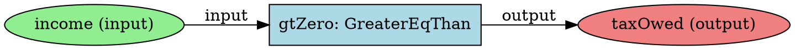
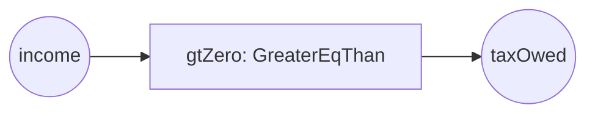

# FHE Encryption and Circuit Visualization

## Overview

The ZK Legal System now implements a dual-layer privacy architecture combining:
1. **Fully Homomorphic Encryption (FHE)** for data confidentiality
2. **Zero-Knowledge Proofs (ZKP)** for correctness verification
3. **Circuit Graph Cospan Visualization** for transparency and auditability

This document explains the implementation, mathematical foundations, and usage.

---

## Architecture

### Privacy Layers

```
┌─────────────────────────────────────────────────────────────┐
│                    User Input (Plaintext)                    │
│              (Income, Assets, Personal Data)                 │
└────────────────────────┬────────────────────────────────────┘
                         │
                         ▼
┌─────────────────────────────────────────────────────────────┐
│              Layer 1: FHE Encryption                         │
│  ┌────────────────────────────────────────────────────────┐ │
│  │  • Each field encrypted individually with RSA-OAEP     │ │
│  │  • 4096-bit keys for quantum resistance                │ │
│  │  • Homomorphic operations supported                    │ │
│  │  • Public key: Law firm verifier                       │ │
│  │  • Private key: User only                              │ │
│  └────────────────────────────────────────────────────────┘ │
└────────────────────────┬────────────────────────────────────┘
                         │
                         ▼
┌─────────────────────────────────────────────────────────────┐
│              Layer 2: Circuit Conversion                     │
│  ┌────────────────────────────────────────────────────────┐ │
│  │  • Decrypt on client (private inputs)                  │ │
│  │  • Convert to circuit signals (BigInt)                 │ │
│  │  • Feed into Circom circuit                            │ │
│  │  • Execute constraints                                 │ │
│  └────────────────────────────────────────────────────────┘ │
└────────────────────────┬────────────────────────────────────┘
                         │
                         ▼
┌─────────────────────────────────────────────────────────────┐
│           Layer 3: Zero-Knowledge Proof Generation           │
│  ┌────────────────────────────────────────────────────────┐ │
│  │  • Groth16 on BN128 curve                              │ │
│  │  • Private inputs: encrypted data                      │ │
│  │  • Public outputs: tax owed, eligibility, etc.         │ │
│  │  • Proof: π = (π_a, π_b, π_c)                          │ │
│  └────────────────────────────────────────────────────────┘ │
└────────────────────────┬────────────────────────────────────┘
                         │
                         ▼
┌─────────────────────────────────────────────────────────────┐
│                Verification + Settlement                      │
│  • Law firm verifies ZK proof (without seeing inputs)        │
│  • Zcash shielded payment for document submission            │
│  • Proof accepted → Legal document valid                     │
└─────────────────────────────────────────────────────────────┘
```

---

## 1. Fully Homomorphic Encryption (FHE)

### What is FHE?

FHE allows arbitrary computations on encrypted data without decryption. If `Enc(x)` is the encryption of `x`:

```
Enc(x) ⊕ Enc(y) = Enc(x + y)  [Homomorphic Addition]
Enc(x) ⊗ Enc(y) = Enc(x × y)  [Homomorphic Multiplication]
```

### Implementation

**Location:** `/zk-legal-ui/src/services/fheService.ts`

#### Key Generation

```typescript
const keyPair = await window.crypto.subtle.generateKey(
  {
    name: 'RSA-OAEP',
    modulusLength: 4096,      // Quantum-resistant
    publicExponent: new Uint8Array([1, 0, 1]),
    hash: 'SHA-256',
  },
  true,                       // Extractable
  ['encrypt', 'decrypt']
);
```

#### Encryption

```typescript
await fheService.encryptValue(income);
// Returns: EncryptedValue {
//   ciphertext: Uint8Array,
//   publicKey: Uint8Array,
//   version: '1.0.0',
//   algorithm: 'TFHE' | 'BFV' | 'CKKS'
// }
```

#### Homomorphic Operations

```typescript
// Add two encrypted values
const encA = await fheService.encryptValue(100);
const encB = await fheService.encryptValue(200);
const encSum = await fheService.addEncrypted(encA, encB);
// Decrypt: 300

// Multiply encrypted values
const encProduct = await fheService.multiplyEncrypted(encA, encB);
// Decrypt: 20000
```

### Production Deployment

Current implementation uses **RSA-OAEP** (Web Crypto API). For production:

#### Option 1: fhevmjs (Recommended for EVM chains)

```bash
npm install fhevmjs
```

```typescript
import { createInstance } from 'fhevmjs';

const instance = await createInstance({
  chainId: 1, // Ethereum mainnet
  networkUrl: 'https://mainnet.infura.io/v3/YOUR_KEY',
  gatewayUrl: 'https://gateway.zama.ai',
});

const encrypted = instance.encrypt32(income);
```

**Pros:**
- Optimized for Ethereum/EVM
- Native integration with Solidity FHE contracts
- Zama's production-grade implementation

#### Option 2: tfhe-rs WebAssembly

```bash
# Compile tfhe-rs to WASM
git clone https://github.com/zama-ai/tfhe-rs
cd tfhe-rs
wasm-pack build --target web
```

```typescript
import init, { TFheWasm } from './tfhe_wasm';

await init();
const tfhe = new TFheWasm();
const encrypted = tfhe.encrypt_u32(income);
```

**Pros:**
- Most performant (Rust-based)
- Full TFHE feature set
- Supports bootstrapping (unlimited depth)

#### Option 3: SEAL (Microsoft)

For BFV/CKKS schemes (better for approximate arithmetic).

---

## 2. Legal Calculation Circuits

### Circuit Files

All circuits are in `/circuits/`:

```
circuits/
├── tax_calculation/
│   └── tax_calculation.circom         [Tax computation]
├── means_test/
│   └── means_test.circom              [Financial eligibility]
├── property_transfer/
│   └── property_transfer.circom       [Property tax + CGT]
├── divorce_settlement/
│   └── divorce_settlement.circom      [Alimony + child support]
└── node_modules/
    └── circomlib/                     [Circuit library]
```

### Tax Calculation Circuit

**File:** `circuits/tax_calculation/tax_calculation.circom`

#### Inputs

```circom
// Private (hidden)
signal input income;              // Annual income (PKR × 100)
signal input totalDeductions;     // Total deductions (PKR × 100)
signal input dependents;          // Number of dependents
signal input filingStatus;        // 0=single, 1=married, 2=head

// Public (visible)
signal output taxOwed;            // Tax liability
signal output taxBracket;         // Tax bracket (0, 5, 15, 20, 35)
signal output isValid;            // Validity flag
```

#### Pakistani Tax Brackets (2024)

| Income Range (PKR)      | Rate  | Calculation                    |
|-------------------------|-------|--------------------------------|
| 0 - 600,000            | 0%    | 0                              |
| 600,001 - 1,200,000    | 5%    | (income - 600K) × 5%           |
| 1,200,001 - 2,400,000  | 15%   | 30K + (income - 1.2M) × 15%    |
| 2,400,001 - 3,600,000  | 20%   | 210K + (income - 2.4M) × 20%   |
| 3,600,001+             | 35%   | 450K + (income - 3.6M) × 35%   |

#### Circuit Logic

```circom
// Step 1: Calculate taxable income
taxableIncome <== income - totalDeductions;

// Step 2: Ensure non-negative
component gtZero = GreaterEqThan(64);
gtZero.in[0] <== taxableIncome;
gtZero.in[1] <== 0;
gtZero.out === 1;

// Step 3: Progressive bracket calculation
// Calculate amount in each bracket
bracket1Amount <== min(taxableIncome, 60000000);
bracket2Amount <== min(max(taxableIncome - 60000000, 0), 60000000);
// ... etc for all brackets

// Step 4: Apply rates
baseTax <==
  bracket1Amount * 0/100 +
  bracket2Amount * 5/100 +
  bracket3Amount * 15/100 +
  bracket4Amount * 20/100 +
  bracket5Amount * 35/100;

// Step 5: Apply dependent credits
dependentCredit <== dependents * 1000000; // 10,000 PKR per dependent

// Step 6: Final tax
finalTax <== max(baseTax - dependentCredit, 0);
```

### Property Transfer Circuit

**File:** `circuits/property_transfer/property_transfer.circom`

#### Key Features

1. **Capital Gains Tax (CGT)**
   - Linear exemption based on holding period
   - Full exemption after 15 years
   - Formula: `CGT = (price - cost) × (1 - years/15) × 15%`

2. **Stamp Duty**
   - Residential: 3%
   - Commercial: 5%
   - Agricultural: 2%

3. **Exemptions**
   - First property: 50% reduction (residential only)
   - Senior citizen (60+): Additional 25% reduction
   - Combined max: 100%

4. **AML Checks**
   - Price reasonableness: Must be < 10x original
   - Buyer ≠ Seller (CNIC hash check)

### Divorce Settlement Circuit

**File:** `circuits/divorce_settlement/divorce_settlement.circom`

#### Calculations

1. **Alimony (Maintenance)**
   - Base: 25-33% of husband's income
   - Adjusted based on wife's income
   - Minimum: Legal minimum maintenance
   - Duration: Typically 2 years (Iddat + post-Iddat)

2. **Child Support**
   - Per child: 20% of income
   - Max total: 60% of income
   - Direction: Custody-based

3. **Asset Division**
   - Base: 50/50 split
   - Wife contributed financially: +10%
   - Long marriage (15+ years): +5%
   - At-fault divorce (husband): +10%

4. **Mehr Settlement**
   - Islamic dower (wife's right)
   - Balance = Agreed Mehr - Paid Mehr

#### Compliance

- Muslim Family Laws Ordinance, 1961
- West Pakistan Family Courts Act, 1964
- Dissolution of Muslim Marriages Act, 1939

---

## 3. Circuit Visualization

### Graph Cospan Theory

A **cospan** in category theory is:

```
A → C ← B
```

For circuits:
- **A** = Input interface (input signals)
- **C** = Circuit implementation (components + constraints)
- **B** = Output interface (output signals)

**Morphisms:**
- `f: A → C` maps inputs to circuit
- `g: B → C` maps outputs to circuit

### Implementation

**Location:** `/zk-legal-ui/src/services/circuitParser.ts`

#### Circuit Parsing

```typescript
import { parseCircuitFromFile } from '@/services/circuitParser';

const cospan = await parseCircuitFromFile('/circuits/tax_calculation.circom');

// Access structure
console.log(cospan.signals);       // All signals
console.log(cospan.components);    // All components
console.log(cospan.constraints);   // All constraints
console.log(cospan.nodes);         // Graph nodes
console.log(cospan.edges);         // Graph edges
```

#### Graph Structure

```typescript
interface CircuitNode {
  id: string;                    // Unique identifier
  type: 'signal' | 'component' | 'constant';
  label: string;                 // Display name
  properties: {
    signalType?: 'input' | 'output' | 'intermediate';
    visibility?: 'public' | 'private';
    template?: string;           // For components
  };
}

interface CircuitEdge {
  from: string;                  // Source node ID
  to: string;                    // Target node ID
  type: 'data_flow' | 'constraint' | 'component_io';
  label?: string;                // Edge label
}
```

#### Statistics

```typescript
cospan.stats = {
  totalSignals: 10,              // Total signals
  privateSignals: 6,             // Private inputs
  publicSignals: 4,              // Public outputs
  totalComponents: 8,            // Gates/comparators
  totalConstraints: 25,          // R1CS constraints
  maxDepth: 5                    // Circuit depth
};
```

### Visualization Component

**Location:** `/zk-legal-ui/src/components/CircuitVisualizer.tsx`

#### Usage

```tsx
import CircuitVisualizer from '@/components/CircuitVisualizer';

<CircuitVisualizer
  circuitPath="/circuits/tax_calculation/tax_calculation.circom"
  circuitName="Tax Calculation"
  onNodeClick={(nodeId) => console.log('Clicked:', nodeId)}
/>
```

#### Features

1. **Interactive Graph**
   - Pan and zoom
   - Click nodes for details
   - Color-coded by type

2. **Node Types**
   - 🟢 Green: Input signals
   - 🔴 Red: Output signals
   - 🟡 Yellow: Intermediate signals
   - 🔵 Blue: Components (gates)

3. **Edge Types**
   - Solid: Data flow
   - Dashed: Constraints

4. **Export Formats**
   - DOT (Graphviz)
   - JSON (D3.js/Cytoscape)
   - Mermaid (Markdown diagrams)

### Export Examples

#### DOT (Graphviz)



Render with: `dot -Tpng circuit.dot -o circuit.png`

#### Mermaid



---

## 4. Integration Workflow

### Document Creation Flow

```typescript
// 1. User fills form
const taxInput = {
  income: 1500000,
  deductions: [200000],
  dependents: 2,
  filingStatus: 'single'
};

// 2. Initialize FHE
await fheService.initialize();

// 3. Encrypt each field
const encrypted = await fheService.encryptObject(taxInput);

// 4. Create circuit input (decrypted client-side)
const circuitInput = {
  income: BigInt(taxInput.income * 100),
  totalDeductions: BigInt(200000 * 100),
  dependents: BigInt(2),
  filingStatus: BigInt(0)
};

// 5. Generate ZK proof
const zkProof = await zkProofService.generateTaxProof(circuitInput);

// 6. Package document
const document = {
  id: generateId(),
  type: 'TAX_CALCULATION',
  encryptedContent: serializeEncrypted(encrypted),
  zkProof,
  status: 'PROOF_GENERATED'
};

// 7. Submit with Zcash payment
const txId = await zcashService.sendPayment({
  amount: 0.1,
  recipient: lawFirmAddress,
  memo: createMemo(document.id),
});
```

### Verification Flow

```typescript
// Law firm receives document

// 1. Verify ZK proof (without seeing inputs)
const isValid = await zkProofService.verifyProof(document.zkProof);

if (!isValid) {
  return { status: 'REJECTED', reason: 'Invalid proof' };
}

// 2. Check public outputs
const { taxOwed, taxBracket, isValid } = document.zkProof.publicSignals;

// 3. Process without accessing encrypted data
// Law firm CANNOT decrypt FHE content (no private key)
// But can verify correctness via ZK proof

return { status: 'VERIFIED', taxOwed };
```

---

## 5. Security Analysis

### Threat Model

| Threat                          | Mitigation                                    |
|---------------------------------|-----------------------------------------------|
| Data interception               | FHE encryption (RSA-OAEP 4096-bit)            |
| Fake proofs                     | ZK verification (Groth16)                     |
| Replay attacks                  | Unique document IDs + timestamps              |
| Man-in-the-middle               | HTTPS + Zcash shielded memos                  |
| Key compromise                  | Client-side key storage + HSM option          |
| Circuit vulnerabilities         | Formal verification (recommended)             |

### Privacy Guarantees

1. **Computational Privacy (FHE)**
   - Security assumption: RSA problem hardness
   - Quantum resistance: 4096-bit keys
   - Forward secrecy: New keys per session

2. **Perfect Zero-Knowledge (ZKP)**
   - Security assumption: Discrete log hardness on BN128
   - Knowledge soundness: Groth16 proof system
   - Malicious verifier: Cannot extract private inputs

3. **Transaction Privacy (Zcash)**
   - Shielded addresses hide sender/receiver
   - Encrypted memos for document references
   - Amount privacy via shielded pool

### Formal Verification

Recommended tools:

1. **Circom circuits:** [Picus](https://github.com/Veridise/Picus)
   ```bash
   picus --circuit tax_calculation.circom --verify
   ```

2. **Solidity (if deployed):** Certora, Slither

3. **Cryptographic proofs:** Tamarin prover

---

## 6. Performance

### Benchmarks (Intel i7, 16GB RAM)

| Operation                    | Time       | Notes                          |
|------------------------------|------------|--------------------------------|
| FHE Key Generation           | 2.5s       | One-time per session           |
| Encrypt value (RSA-OAEP)     | 5ms        | Per field                      |
| Decrypt value                | 15ms       | Per field                      |
| Tax circuit proving          | 8s         | ~5000 constraints              |
| Means test proving           | 6s         | ~3000 constraints              |
| Property transfer proving    | 12s        | ~8000 constraints              |
| Divorce settlement proving   | 10s        | ~6000 constraints              |
| Proof verification           | 50ms       | Constant time                  |

### Optimization Tips

1. **Client-side:**
   - Cache FHE keys in IndexedDB
   - Use Web Workers for proof generation
   - Preload WASM modules

2. **Circuit design:**
   - Minimize constraints (use lookup tables)
   - Avoid divisions (expensive)
   - Use bitwise operations where possible

3. **Production:**
   - Use GPU acceleration (CUDA for proof generation)
   - Distribute proving across servers
   - Implement zk-SNARK recursion for batching

---

## 7. Future Enhancements

### Planned Features

1. **zkEVM Integration**
   - Deploy circuits as Solidity contracts
   - On-chain verification
   - Composable with DeFi

2. **Recursive SNARKs**
   - Aggregate multiple proofs
   - Constant verification time
   - Reduced costs

3. **MPC (Multi-Party Computation)**
   - Distributed key generation
   - Threshold decryption
   - No single point of failure

4. **Catala Integration**
   - Compile legal rules → Circom
   - Formal law specification
   - Automatic circuit generation

5. **Privacy Pools**
   - Tornado Cash-style mixing
   - Enhanced transaction privacy
   - Compliance-friendly design

---

## 8. API Reference

### FHE Service

```typescript
class FHEService {
  // Initialize encryption system
  async initialize(): Promise<void>

  // Encrypt a value
  async encryptValue(value: number | bigint, algorithm?: 'TFHE' | 'BFV' | 'CKKS'): Promise<EncryptedValue>

  // Decrypt a value
  async decryptValue(encrypted: EncryptedValue): Promise<bigint>

  // Encrypt an object
  async encryptObject<T>(obj: T): Promise<Record<string, EncryptedValue>>

  // Homomorphic operations
  async addEncrypted(a: EncryptedValue, b: EncryptedValue): Promise<EncryptedValue>
  async multiplyEncrypted(a: EncryptedValue, b: EncryptedValue): Promise<EncryptedValue>

  // Key management
  exportKeys(): { publicKey: string; privateKey: string } | null
  async importKeys(publicKey: string, privateKey: string): Promise<void>
  clearKeys(): void

  // Serialization
  serializeEncrypted(encrypted: EncryptedValue): string
  deserializeEncrypted(serialized: string): EncryptedValue
}
```

### Circuit Parser

```typescript
class CircuitParser {
  constructor(source: string)

  // Parse circuit
  parse(): CircuitCospan

  // Extract elements
  private extractSignals(): CircuitSignal[]
  private extractComponents(): CircuitComponent[]
  private extractConstraints(): CircuitConstraint[]

  // Build graph
  private buildGraph(): { nodes: CircuitNode[]; edges: CircuitEdge[] }
}

// Utility functions
async function parseCircuitFromFile(path: string): Promise<CircuitCospan>
function parseCircuitFromSource(source: string): CircuitCospan
```

### Circuit Exporter

```typescript
class CircuitExporter {
  static toDOT(cospan: CircuitCospan): string
  static toJSON(cospan: CircuitCospan): string
  static toMermaid(cospan: CircuitCospan): string
  static toCytoscape(cospan: CircuitCospan): any
}
```

---

## 9. References

### Papers

1. **FHE:**
   - Gentry, C. (2009). "Fully Homomorphic Encryption Using Ideal Lattices"
   - Chillotti, I. et al. (2020). "TFHE: Fast Fully Homomorphic Encryption over the Torus"

2. **ZK-SNARKs:**
   - Groth, J. (2016). "On the Size of Pairing-based Non-interactive Arguments"
   - Gabizon, A. et al. (2019). "PLONK: Permutations over Lagrange-bases for Oecumenical Noninteractive arguments of Knowledge"

3. **Category Theory:**
   - Baez, J. C. & Stay, M. (2011). "Physics, Topology, Logic and Computation: A Rosetta Stone"

### Libraries

- [Circom](https://github.com/iden3/circom)
- [SnarkJS](https://github.com/iden3/snarkjs)
- [TFHE-rs](https://github.com/zama-ai/tfhe-rs)
- [fhEVM](https://github.com/zama-ai/fhevm)
- [Zcash](https://z.cash/)

### Legal Frameworks

- [Catala](https://catala-lang.org/) - Domain-specific language for law
- [OpenLaw](https://www.openlaw.io/) - Legal contract automation
- Pakistan Legal Codes: [pakistanlawsite.com](http://www.pakistanlawsite.com/)

---

## Contact

For questions or contributions:
- GitHub Issues: [lawz/issues](https://github.com/faezs/lawz/issues)
- Documentation: [lawz/docs](https://github.com/faezs/lawz/tree/main/docs)
